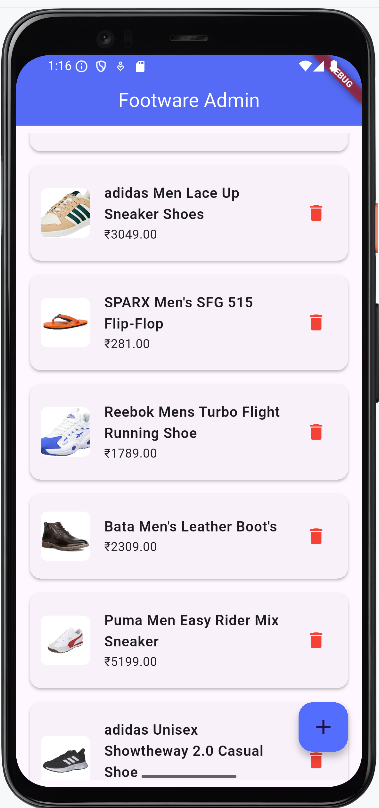
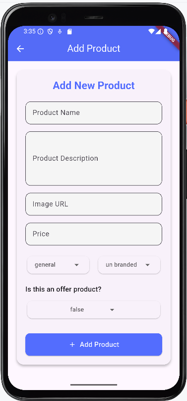
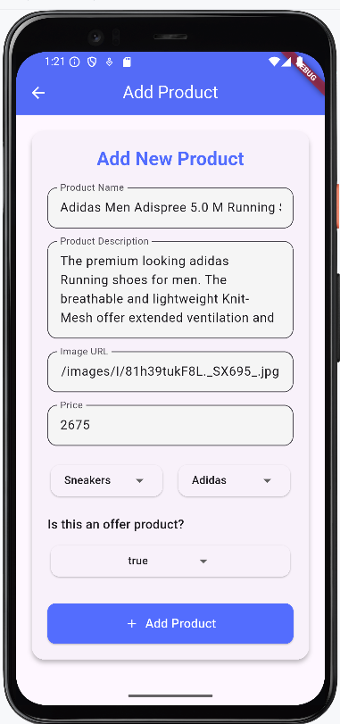
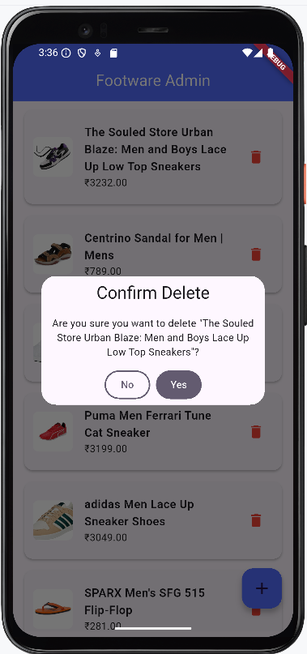

ClickKart Admin App

ClickKart Admin is the backend management app for the ClickKart ecosystem.
It empowers store administrators to manage product listings directly via a clean and intuitive Flutter interface.

---

## 🧩 Key Features

- ➕ **Add New Products** (Name, Price, Description, Image, Category)
- 🗑️ **Delete Products** from Firestore
- 📦 **Display All Products** in a structured grid/list format
- 📁 **Firebase Firestore** integration for real-time database
- ⚙️ **GetX** for efficient state management

---

## 📱 Admin Panel Screenshots


<p float="left">
  
  
</p>

<p float="left">
  
  
</p>


---

## ⚙️ Tech Stack

- **Flutter**
- **Firebase Firestore**
- **GetX** (State Management & Routing)

---

## 📂 Folder Structure

clickkart_admin/
│
├── assets/
│ └── images/
│ └── *.png (Admin UI screenshots)
│
├── lib/
│ ├── controller/
│ ├── model/
│ ├── pages/
│ └── main.dart

yaml
Copy
Edit

---

## 🚀 Getting Started

1. Clone this repository:
   ```bash
   git clone https://github.com/PremmChand/clickkart_admin.git
   cd clickkart_admin
Install dependencies:

flutter pub get

Run the app:

flutter run
🛡️ Firebase Setup
Ensure you have:

A Firebase project created

Firestore enabled

google-services.json file added under android/app/

Built with ❤️ for admin management by PremmChand

